# NPULearn 技术文档

## 项目概述

NPULearn 是一个基于 Tauri + Vue + TypeScript 构建的智能学习助手桌面应用，集成多种AI模型和学习工具，为用户提供全面的学习支持。

## 设计思路与理念

### 1. 核心设计哲学

#### 用户中心设计原则
- **简洁至上**: 界面清爽简洁，专注于内容而非装饰
- **直观交互**: 所有功能都能通过直观的交互方式完成
- **无障碍体验**: 支持键盘导航、屏幕阅读器和高对比度模式
- **响应式设计**: 适配不同屏幕尺寸和设备类型

#### 技术架构理念
- **模块化优先**: 每个功能模块独立开发、测试和部署
- **性能导向**: 使用Rust后端确保高性能计算和内存安全
- **类型安全**: 全栈TypeScript保证代码质量和维护性
- **异步优先**: 所有I/O操作都采用异步模式，确保界面流畅

### 2. 设计决策与权衡

#### 技术栈选择理由

**前端：Vue 3 + TypeScript**
- 组合式API提供更好的逻辑复用和状态管理
- 响应式数据绑定简化状态管理
- 类型安全保证代码质量

**后端：Rust + Tauri**
- 高性能的异步处理能力
- 内存安全和并发优势
- 跨平台原生应用支持

**渲染系统：多引擎集成**
- **MathJax**: 高质量数学公式渲染
- **Mermaid**: 丰富的图表类型支持
- **KaTeX**: 快速数学表达式渲染
- **Typst**: 现代化文档排版

#### 架构优势
1. **跨平台一致性**: Tauri确保在各平台上的一致体验
2. **性能与安全**: Rust后端提供C++级别性能和内存安全
3. **开发效率**: Vue 3的开发体验和TypeScript的类型安全
4. **包体积优化**: 相比Electron显著减小安装包体积

### 3. 用户体验设计原则

#### 渐进式功能揭示
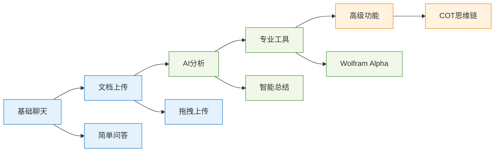

#### 智能默认设置
- **主题跟随系统**: 自动适配用户系统主题偏好
- **智能字体大小**: 根据设备DPI自动调整
- **模型自动选择**: 根据查询类型智能推荐AI模型
- **历史记录分组**: 按时间和主题智能分组历史对话

## AI应用架构与实现

### 1. 统一AI接口设计

#### 接口抽象层
采用统一的AI接口设计，支持多种AI模型的无缝切换。通过抽象层隔离具体实现，使系统能够轻松集成新的AI服务商，同时保持调用方式的一致性。

#### 模型适配器模式
为不同AI模型提供标准化的配置接口，包括模型能力、限制参数、成本计算等信息。系统可以根据这些配置信息自动选择最适合的模型处理用户请求。

### 2. 智能对话管理系统

#### 上下文管理策略
实现智能的上下文压缩算法，在维持对话连贯性的同时控制上下文长度。系统会自动保留系统提示、重要历史消息和最近对话，确保AI能够理解当前对话背景。

#### COT（思维链）功能实现
提供可视化的AI推理过程展示，将复杂的思考步骤分解为用户可理解的步骤。支持折叠/展开显示，让用户既能看到最终结果，也能了解推理过程。

### 3. 流式响应处理机制

#### 实时渲染架构
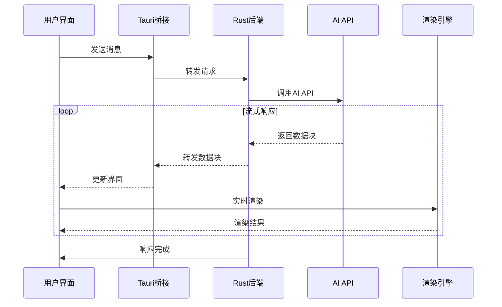

#### 错误恢复与重试机制
采用智能重试策略，包括指数退避算法、多重错误处理机制和优雅降级方案。确保在网络不稳定或API服务异常时仍能提供基本功能。
```

### 4. 多模态处理能力

#### 文档理解流程
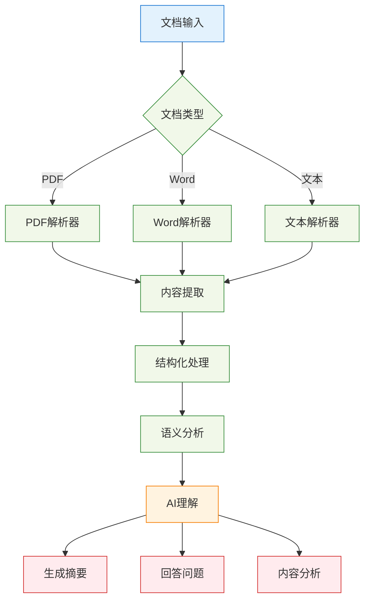

#### 智能内容理解
```rust
// 文档内容智能分析
pub async fn analyze_document_content(
    content: &str,
    document_type: DocumentType,
) -> Result<DocumentAnalysis, AnalysisError> {
    let analysis = DocumentAnalysis {
        summary: extract_summary(content).await?,
        key_points: extract_key_points(content).await?,
        document_structure: analyze_structure(content, document_type)?,
        topics: extract_topics(content).await?,
        complexity_level: assess_complexity(content),
    };
    
    Ok(analysis)
}
```

### 5. 个性化与学习优化

#### 用户偏好学习
```typescript
// 用户交互模式学习
interface UserPreferences {
    preferredAIModel: string;
    commonTopics: string[];
    responseStyle: 'concise' | 'detailed' | 'technical';
    frequentTools: string[];
    learningGoals: string[];
}

export class PreferenceLearner {
    private preferences: UserPreferences;
    
    // 从用户行为中学习偏好
    public updateFromInteraction(interaction: UserInteraction): void {
        // 更新常用主题
        this.updateTopicPreferences(interaction.topic);
        
        // 学习响应风格偏好
        this.learnResponseStyle(interaction);
        
        // 记录工具使用频率
        this.updateToolUsage(interaction.toolsUsed);
    }
    
    // 个性化推荐
    public getRecommendations(): Recommendation[] {
        return [
            this.recommendModel(),
            this.recommendTools(),
            this.recommendTopics()
        ];
    }
}
```

### 6. 性能监控与优化

#### 实时性能监控
```typescript
// 性能监控系统
export class PerformanceMonitor {
    private metrics: Map<string, PerformanceMetric> = new Map();
    
    public startMeasurement(operation: string): PerformanceMarker {
        const marker = {
            operation,
            startTime: performance.now(),
            memoryBefore: this.getMemoryUsage()
        };
        
        return marker;
    }
    
    public endMeasurement(marker: PerformanceMarker): void {
        const endTime = performance.now();
        const memoryAfter = this.getMemoryUsage();
        
        const metric: PerformanceMetric = {
            operation: marker.operation,
            duration: endTime - marker.startTime,
            memoryDelta: memoryAfter - marker.memoryBefore,
            timestamp: new Date()
        };
        
        this.recordMetric(metric);
        this.optimizeIfNeeded(metric);
    }
}
```

#### 智能缓存策略
```rust
// 多级缓存系统
pub struct IntelligentCache {
    // L1: 内存缓存 - 最频繁访问的数据
    memory_cache: LruCache<String, CachedResponse>,
    
    // L2: 磁盘缓存 - 持久化热点数据
    disk_cache: DiskCache,
    
    // L3: 压缩缓存 - 大量数据的压缩存储
    compressed_cache: CompressedCache,
}

impl IntelligentCache {
    // 智能缓存决策
    pub async fn cache_response(
        &mut self,
        key: &str,
        response: &str,
        usage_frequency: f64,
        data_size: usize,
    ) -> Result<(), CacheError> {
        // 根据使用频率和数据大小决定缓存策略
        if usage_frequency > 0.8 && data_size < 1024 * 1024 {
            // 高频小数据 -> 内存缓存
            self.memory_cache.put(key.to_string(), response.into());
        } else if usage_frequency > 0.3 {
            // 中频数据 -> 磁盘缓存
            self.disk_cache.store(key, response).await?;
        } else {
            // 低频大数据 -> 压缩缓存
            self.compressed_cache.store_compressed(key, response).await?;
        }
        
        Ok(())
    }
}
```

## 技术架构

### 架构图

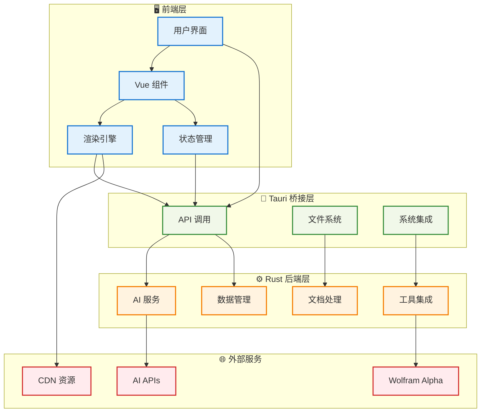

### 技术栈详情

#### 前端技术栈
- **Vue 3** - 现代化响应式前端框架
- **TypeScript** - 类型安全的JavaScript超集
- **Vite** - 快速的构建工具和开发服务器
- **Composition API** - Vue 3的组合式API

#### 后端技术栈
- **Tauri** - 跨平台桌面应用框架
- **Rust** - 系统级编程语言，提供高性能和内存安全
- **Tokio** - 异步运行时
- **Reqwest** - HTTP客户端库
- **Serde** - 序列化/反序列化框架

#### 构建工具
- **Bun** - 高性能JavaScript运行时和包管理器
- **Cargo** - Rust包管理和构建系统

### 数据流图

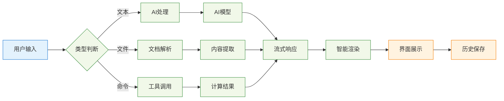

## 核心功能模块

### 1. AI聊天助手

#### 设计思路
采用统一的AI接口设计，支持多种AI模型的无缝切换：

```rust
pub(crate) trait AIChat {
    async fn generate_response_stream<F>(
        &mut self,
        api_key: ApiKey,
        prompt: String,
        callback: F,
    ) -> Result<String, Box<dyn Error>>
    where
        F: FnMut(String) + Send + 'static;
}
```

#### 支持的AI模型
- **DeepSeek** - 专业的编程和技术问答模型
- **Gemini** - Google的多模态AI模型

#### 创意亮点
1. **流式响应**: 实时显示AI回复，提升用户体验
2. **COT（思维链）功能**: 增强问题解决能力，显示推理过程
3. **上下文管理**: 智能维护对话历史，支持长对话
4. **API密钥轮换**: 支持多个API密钥自动轮换，提高可用性

#### AI对话处理流程

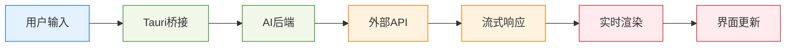

### 2. 富文本渲染系统

#### 系统架构
采用模块化的渲染器设计，每个渲染器负责特定类型的内容：

```typescript
// 渲染系统接口
interface Renderer {
    render(content: string): Promise<string>;
    canHandle(content: string): boolean;
}
```

#### 支持的渲染类型

##### Markdown渲染
- 完整的GitHub风格Markdown支持
- 代码语法高亮（highlight.js）
- 自定义CSS样式

##### 数学公式渲染
- **MathJax** - LaTeX数学公式渲染
- **KaTeX** - 快速数学表达式渲染
- 支持行内和块级公式

##### 图表渲染
- **Mermaid** - 流程图、时序图、甘特图等
- **Pintora** - 多种图表类型支持
- 动态主题切换
- 交互式图表查看器

```typescript
// Mermaid渲染示例
async function renderMermaidDiagrams() {
    const isDark = document.documentElement.getAttribute('data-theme') === 'dark';
    
    mermaid.initialize({
        theme: isDark ? 'dark' : 'default',
        securityLevel: 'loose',
        startOnLoad: false
    });
}
```

##### Typst排版系统
- 现代化文档排版
- 高质量数学排版
- 支持多语言文档

#### 创意亮点
1. **智能渲染队列**: 异步渲染，不阻塞用户界面
2. **错误恢复机制**: 渲染失败时提供重试功能
3. **缓存优化**: 避免重复渲染相同内容
4. **主题适配**: 所有渲染内容自动适配亮/暗主题

#### 渲染系统架构

```mermaid
flowchart TD
    A[输入内容] --> B{内容类型}
    
    B -->|Markdown| C[MD渲染]
    B -->|数学公式| D[数学渲染]
    B -->|图表| E[图表渲染]
    B -->|文档| F[文档渲染]
    
    subgraph "渲染引擎"
        C --> G[HTML输出]
        D --> G
        E --> G
        F --> G
    end
    
    G --> H[缓存系统]
    H --> I[界面显示]
    
    classDef input fill:#e3f2fd,stroke:#1976d2
    classDef process fill:#f1f8e9,stroke:#388e3c
    classDef output fill:#fff3e0,stroke:#f57c00
    
    class A input
    class B,C,D,E,F,G,H process    class F,G output
```

## AI应用创新特性

### 1. 多AI模型融合策略

#### 模型路由智能决策
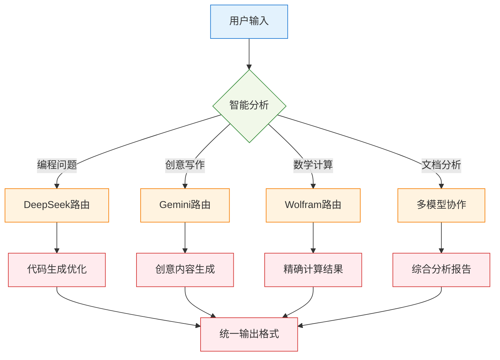

#### 动态模型选择算法
```typescript
// 智能模型选择系统
export class ModelRouter {
    private modelCapabilities = {
        'deepseek': {
            strengths: ['coding', 'technical-analysis', 'debugging', 'algorithms'],
            weaknesses: ['creative-writing', 'casual-conversation'],
            contextLimit: 32768,
            costPerToken: 0.0001
        },
        'gemini': {
            strengths: ['creative-writing', 'general-conversation', 'multimodal'],
            weaknesses: ['complex-coding', 'mathematical-proofs'],
            contextLimit: 30720,
            costPerToken: 0.0002
        }
    };
    
    public selectOptimalModel(query: string, context: ConversationContext): string {
        const queryFeatures = this.analyzeQuery(query);
        const scores = new Map<string, number>();
        
        for (const [model, capabilities] of Object.entries(this.modelCapabilities)) {
            let score = 0;
            
            // 基于查询特征计算适配分数
            for (const feature of queryFeatures) {
                if (capabilities.strengths.includes(feature)) {
                    score += 2;
                } else if (capabilities.weaknesses.includes(feature)) {
                    score -= 1;
                }
            }
            
            // 考虑上下文长度限制
            if (context.totalTokens < capabilities.contextLimit) {
                score += 1;
            }
            
            // 考虑成本效益
            score -= capabilities.costPerToken * 1000;
            
            scores.set(model, score);
        }
        
        return Array.from(scores.entries())
            .sort(([,a], [,b]) => b - a)[0][0];
    }
}
```

### 2. 高级推理能力增强

#### 思维链（COT）深度实现
```rust
// 思维链处理器
pub struct ChainOfThoughtProcessor {
    reasoning_steps: Vec<ReasoningStep>,
    confidence_scores: Vec<f64>,
    verification_methods: Vec<VerificationMethod>,
}

impl ChainOfThoughtProcessor {
    // 生成结构化思维链
    pub async fn generate_reasoning_chain(
        &mut self,
        problem: &str,
        complexity: ComplexityLevel,
    ) -> Result<ReasoningChain, ProcessingError> {
        let steps = match complexity {
            ComplexityLevel::Simple => self.generate_basic_steps(problem).await?,
            ComplexityLevel::Complex => self.generate_advanced_steps(problem).await?,
            ComplexityLevel::Expert => self.generate_expert_steps(problem).await?,
        };
        
        // 为每个步骤生成置信度分数
        let confidence_scores = self.calculate_confidence(&steps);
        
        // 添加验证步骤
        let verification_steps = self.add_verification(&steps);
        
        Ok(ReasoningChain {
            steps,
            confidence_scores,
            verification_steps,
            metadata: self.generate_metadata(),
        })
    }
    
    // 可视化思维过程
    pub fn format_for_display(&self, chain: &ReasoningChain) -> String {
        let mut formatted = String::from("<details>\n<summary>🧠 思考过程</summary>\n\n");
        
        for (i, step) in chain.steps.iter().enumerate() {
            formatted.push_str(&format!(
                "**步骤 {}**: {}\n",
                i + 1,
                step.description
            ));
            
            if let Some(reasoning) = &step.reasoning {
                formatted.push_str(&format!(
                    "*推理*: {}\n",
                    reasoning
                ));
            }
            
            formatted.push_str(&format!(
                "*置信度*: {:.1}%\n\n",
                chain.confidence_scores[i] * 100.0
            ));
        }
        
        formatted.push_str("</details>\n\n");
        formatted
    }
}
```

#### 自我验证与纠错机制
```typescript
// AI响应质量验证系统
export class ResponseValidator {
    private validationRules: ValidationRule[] = [
        {
            name: 'factual_consistency',
            weight: 0.3,
            validator: this.checkFactualConsistency.bind(this)
        },
        {
            name: 'logical_coherence',
            weight: 0.25,
            validator: this.checkLogicalCoherence.bind(this)
        },
        {
            name: 'completeness',
            weight: 0.2,
            validator: this.checkCompleteness.bind(this)
        },
        {
            name: 'clarity',
            weight: 0.15,
            validator: this.checkClarity.bind(this)
        },
        {
            name: 'relevance',
            weight: 0.1,
            validator: this.checkRelevance.bind(this)
        }
    ];
    
    public async validateResponse(
        query: string,
        response: string,
        context: ConversationContext
    ): Promise<ValidationResult> {
        const scores = new Map<string, number>();
        
        for (const rule of this.validationRules) {
            const score = await rule.validator(query, response, context);
            scores.set(rule.name, score * rule.weight);
        }
        
        const totalScore = Array.from(scores.values()).reduce((a, b) => a + b, 0);
        const issues = this.identifyIssues(scores);
        
        return {
            overall_score: totalScore,
            detailed_scores: scores,
            issues,
            suggestions: this.generateSuggestions(issues),
            should_regenerate: totalScore < 0.7
        };
    }
    
    // 智能错误纠正
    private async correctErrors(
        response: string,
        issues: ValidationIssue[]
    ): Promise<string> {
        let correctedResponse = response;
        
        for (const issue of issues) {
            switch (issue.type) {
                case 'factual_error':
                    correctedResponse = await this.correctFactualError(
                        correctedResponse, 
                        issue
                    );
                    break;
                case 'logical_inconsistency':
                    correctedResponse = await this.fixLogicalIssue(
                        correctedResponse, 
                        issue
                    );
                    break;
                case 'incomplete_answer':
                    correctedResponse = await this.completeAnswer(
                        correctedResponse, 
                        issue
                    );
                    break;
            }
        }
        
        return correctedResponse;
    }
}
```

### 3. 智能工具协作系统

#### 工具链编排引擎
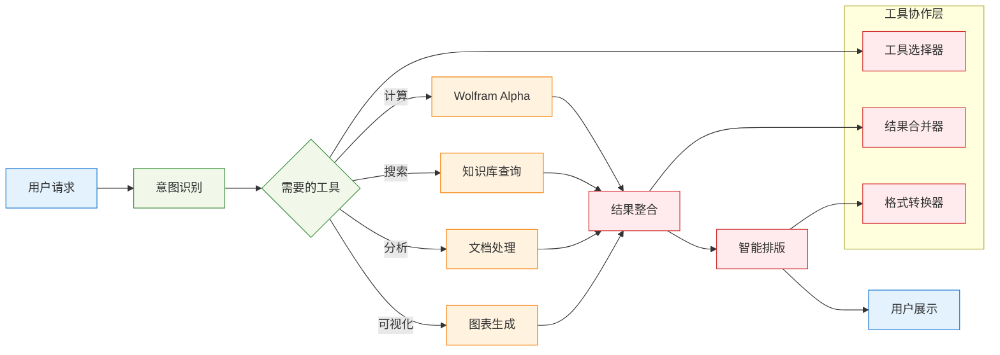

#### 智能工具调用决策
```rust
// 工具编排系统
pub struct ToolOrchestrator {
    available_tools: HashMap<String, Box<dyn Tool>>,
    tool_dependencies: Graph<String>,
    execution_history: Vec<ToolExecution>,
}

impl ToolOrchestrator {
    // 智能工具链规划
    pub async fn plan_tool_chain(
        &self,
        query: &str,
        user_context: &UserContext,
    ) -> Result<ExecutionPlan, PlanningError> {
        let required_capabilities = self.analyze_requirements(query);
        let available_tools = self.get_available_tools();
        
        let mut plan = ExecutionPlan::new();
        
        // 使用图搜索算法找到最优工具组合
        let optimal_sequence = self.find_optimal_tool_sequence(
            &required_capabilities,
            &available_tools,
            user_context
        )?;
        
        for tool_call in optimal_sequence {
            plan.add_step(ToolStep {
                tool_name: tool_call.tool,
                parameters: tool_call.params,
                expected_output: tool_call.output_type,
                fallback_options: self.get_fallback_tools(&tool_call.tool),
            });
        }
        
        Ok(plan)
    }
    
    // 并行工具执行
    pub async fn execute_parallel(
        &mut self,
        plan: &ExecutionPlan,
    ) -> Result<CombinedResult, ExecutionError> {
        let mut handles = Vec::new();
        
        // 识别可并行执行的工具
        let parallel_groups = self.identify_parallel_groups(plan);
        
        for group in parallel_groups {
            let group_handles: Vec<_> = group.into_iter()
                .map(|step| {
                    let tool = self.available_tools.get(&step.tool_name).unwrap();
                    tokio::spawn(async move {
                        tool.execute(step.parameters).await
                    })
                })
                .collect();
            
            handles.push(group_handles);
        }
        
        // 等待所有工具执行完成并合并结果
        let mut combined_result = CombinedResult::new();
        
        for group_handles in handles {
            let group_results = futures::future::join_all(group_handles).await;
            combined_result.merge_group_results(group_results)?;
        }
        
        Ok(combined_result)
    }
}
```

### 4. 上下文感知与记忆管理

#### 长期记忆系统
```typescript
// 智能记忆管理系统
export class MemoryManager {
    private shortTermMemory: ConversationBuffer;
    private longTermMemory: PersistentKnowledgeBase;
    private episodicMemory: EpisodeStorage;
    private semanticMemory: ConceptGraph;
    
    // 知识提取与存储
    public async extractAndStoreKnowledge(
        conversation: Conversation
    ): Promise<void> {
        // 提取关键概念
        const concepts = await this.extractConcepts(conversation);
        
        // 识别重要事实
        const facts = await this.extractFacts(conversation);
        
        // 建立概念关联
        const relationships = await this.identifyRelationships(concepts);
        
        // 更新语义网络
        await this.semanticMemory.updateGraph(concepts, relationships);
        
        // 存储情节记忆
        await this.episodicMemory.storeEpisode({
            timestamp: new Date(),
            participants: conversation.participants,
            topics: concepts.map(c => c.topic),
            emotional_context: conversation.emotional_tone,
            outcomes: conversation.resolutions
        });
        
        // 强化重要记忆
        await this.reinforceImportantMemories(facts, concepts);
    }
    
    // 智能记忆检索
    public async retrieveRelevantMemory(
        query: string,
        context: ConversationContext
    ): Promise<RelevantMemory> {
        const queryEmbedding = await this.generateEmbedding(query);
        
        // 从多个记忆层检索
        const [
            semanticMemories,
            episodicMemories,
            factualMemories
        ] = await Promise.all([
            this.semanticMemory.searchSimilar(queryEmbedding, 5),
            this.episodicMemory.findRelevantEpisodes(context, 3),
            this.longTermMemory.queryFacts(query, 10)
        ]);
        
        // 记忆融合与排序
        const rankedMemories = this.rankMemoriesByRelevance(
            [...semanticMemories, ...episodicMemories, ...factualMemories],
            query,
            context
        );
        
        return {
            primary_memories: rankedMemories.slice(0, 3),
            supporting_memories: rankedMemories.slice(3, 8),
            confidence_scores: rankedMemories.map(m => m.confidence),
            retrieval_strategy: this.getRetrievalStrategy(query)
        };
    }
    
    // 记忆遗忘机制
    public async performMemoryMaintenance(): Promise<void> {
        // 计算记忆重要性分数
        const allMemories = await this.getAllMemories();
        
        for (const memory of allMemories) {
            const importance = this.calculateImportance(memory);
            const recency = this.calculateRecency(memory);
            const frequency = this.calculateAccessFrequency(memory);
            
            // 遗忘函数：importance * recency * frequency
            const retentionScore = importance * recency * frequency;
            
            if (retentionScore < this.forgettingThreshold) {
                await this.fadeMemory(memory);
            } else if (retentionScore > this.consolidationThreshold) {
                await this.consolidateMemory(memory);
            }
        }
        
        // 清理冗余记忆
        await this.deduplicateMemories();
        
        // 压缩旧记忆
        await this.compressOldMemories();
    }
}
```

#### 个性化学习适应
```rust
// 个性化学习系统
pub struct PersonalizationEngine {
    user_profile: UserProfile,
    learning_preferences: LearningPreferences,
    interaction_patterns: InteractionPatterns,
    knowledge_gaps: Vec<KnowledgeGap>,
}

impl PersonalizationEngine {
    // 个性化内容推荐
    pub async fn generate_personalized_content(
        &self,
        topic: &str,
        user_context: &UserContext,
    ) -> Result<PersonalizedContent, PersonalizationError> {
        let user_level = self.assess_user_knowledge_level(topic);
        let learning_style = &self.learning_preferences.preferred_style;
        let current_goals = &self.user_profile.learning_goals;
        
        let content = match learning_style {
            LearningStyle::Visual => {
                self.generate_visual_content(topic, user_level).await?
            },
            LearningStyle::Auditory => {
                self.generate_audio_content(topic, user_level).await?
            },
            LearningStyle::Kinesthetic => {
                self.generate_interactive_content(topic, user_level).await?
            },
            LearningStyle::ReadingWriting => {
                self.generate_textual_content(topic, user_level).await?
            },
        };
        
        // 根据知识空隙调整内容
        let adjusted_content = self.fill_knowledge_gaps(content, topic);
        
        // 添加个性化练习
        let exercises = self.generate_personalized_exercises(
            topic, 
            user_level, 
            learning_style
        ).await?;
        
        Ok(PersonalizedContent {
            main_content: adjusted_content,
            exercises,
            difficulty_level: user_level,
            estimated_completion_time: self.estimate_completion_time(&content),
            next_topics: self.recommend_next_topics(topic, current_goals),
        })
    }
    
    // 学习进度跟踪
    pub fn track_learning_progress(
        &mut self,
        topic: &str,
        performance_data: PerformanceData,
    ) {
        // 更新用户知识图谱
        self.update_knowledge_graph(topic, &performance_data);
        
        // 调整难度预测模型
        self.adjust_difficulty_model(&performance_data);
        
        // 识别新的知识空隙
        let new_gaps = self.identify_knowledge_gaps(topic, &performance_data);
        self.knowledge_gaps.extend(new_gaps);
        
        // 更新学习偏好模型
        self.update_preference_model(&performance_data);
        
        // 生成学习建议
        let suggestions = self.generate_learning_suggestions(topic, &performance_data);
        self.user_profile.add_suggestions(suggestions);
    }
}
```

### 5. 创新交互体验

#### 多模态交互界面
```typescript
// 多模态输入处理器
export class MultimodalInputProcessor {
    private voiceRecognizer: VoiceRecognizer;
    private gestureDetector: GestureDetector;
    private contextAnalyzer: ContextAnalyzer;
    
    // 统一输入处理
    public async processInput(input: MultimodalInput): Promise<ProcessedInput> {
        const results = await Promise.all([
            this.processText(input.text),
            this.processVoice(input.audio),
            this.processGestures(input.gestures),
            this.processImages(input.images)
        ]);
        
        // 多模态融合
        const fusedInput = this.fuseInputModalities(results);
        
        // 上下文增强
        const contextualInput = await this.enhanceWithContext(
            fusedInput, 
            input.context
        );
        
        return {
            unified_representation: contextualInput,
            confidence_scores: this.calculateConfidenceScores(results),
            modality_weights: this.calculateModalityWeights(input),
            interpretation_alternatives: this.generateAlternatives(results)
        };
    }
    
    // 智能输入预测
    public async predictUserIntent(
        partialInput: PartialInput,
        interactionHistory: InteractionHistory
    ): Promise<IntentPrediction[]> {
        const patterns = this.analyzeInputPatterns(interactionHistory);
        const currentContext = await this.getCurrentContext();
        
        const predictions = [];
        
        // 基于历史模式预测
        for (const pattern of patterns) {
            const similarity = this.calculatePatternSimilarity(partialInput, pattern);
            if (similarity > 0.7) {
                predictions.push({
                    intent: pattern.intent,
                    confidence: similarity,
                    completion_suggestion: pattern.typical_completion,
                    estimated_tokens: pattern.average_length
                });
            }
        }
        
        // 基于上下文预测
        const contextualPredictions = await this.predictFromContext(
            partialInput, 
            currentContext
        );
        
        predictions.push(...contextualPredictions);
        
        return predictions
            .sort((a, b) => b.confidence - a.confidence)
            .slice(0, 5);
    }
}
```

#### 自适应UI系统
```vue
<template>
  <div class="adaptive-interface" :class="interfaceClasses">
    <!-- 动态布局组件 -->
    <component 
      :is="currentLayout" 
      :user-preferences="userPreferences"
      :interaction-mode="interactionMode"
      @layout-change="handleLayoutChange"
    />
    
    <!-- 智能快捷操作 -->
    <QuickActions 
      :actions="predictedActions"
      :user-context="userContext"
      @action-performed="trackAction"
    />
    
    <!-- 个性化侧边栏 -->
    <PersonalizedSidebar
      :visible="sidebarVisible"
      :content="personalizedContent"
      :learning-goals="learningGoals"
    />
  </div>
</template>

<script setup lang="ts">
// 自适应界面逻辑
const adaptiveInterface = reactive({
  layout: 'default',
  density: 'comfortable',
  colorScheme: 'auto',
  accessibility: {
    highContrast: false,
    largeText: false,
    reducedMotion: false
  }
});

// 用户行为分析
const behaviorAnalyzer = new BehaviorAnalyzer();

// 界面自适应逻辑
watch([userPreferences, interactionPatterns], async ([prefs, patterns]) => {
  const optimalLayout = await calculateOptimalLayout(prefs, patterns);
  const accessibility = detectAccessibilityNeeds(patterns);
  
  adaptiveInterface.layout = optimalLayout.name;
  adaptiveInterface.density = optimalLayout.density;
  adaptiveInterface.accessibility = accessibility;
  
  // 渐进式界面调整
  await animateLayoutTransition(optimalLayout);
});

// 预测用户下一步操作
const predictedActions = computed(() => {
  return behaviorAnalyzer.predictNextActions(
    currentConversation.value,
    recentInteractions.value,
    userGoals.value
  );
});
</script>
```

### 3. Wolfram Alpha集成

#### 设计思路
将强大的计算引擎直接集成到聊天界面中：

```rust
pub async fn wolfram_alpha_compute(
    query: &str,
    image_only: bool,
) -> Result<Vec<WolframResult>, String> {
    // 调用Wolfram Alpha API
    // 解析结果并格式化
}
```

#### 功能特点
- **实时计算**: 在聊天中直接进行复杂数学计算
- **多格式输出**: 支持文本、图像、MathML等格式
- **相关查询**: 智能推荐相关计算
- **交互式结果**: 点击相关查询可直接发起新计算

#### 创意亮点
1. **智能格式选择**: 根据查询类型自动选择最佳展示格式
2. **结果缓存**: 避免重复API调用
3. **一键查询**: 相关查询可一键发送

### 4. 文档处理系统

#### 支持的文档类型
- **Word文档** (.docx) - 完整的文档解析
- **PDF文档** - 文本提取和分析
- **纯文本** - 智能编码检测

#### 处理流程
```rust
pub fn read_word_document(file_path: &str) -> Result<String, String> {
    // 解析Word文档结构
    // 提取文本内容
    // 保持格式信息
}
```

### 5. 主题系统

#### 设计理念
提供一致的视觉体验和无障碍访问：

```typescript
export function applyTheme(theme: 'system' | 'light' | 'dark'): void {
    if (theme === 'system') {
        document.documentElement.removeAttribute('data-theme');
    } else {
        document.documentElement.setAttribute('data-theme', theme);
    }
    refreshGlobalStyles();
}
```

#### 主题特性
- **系统跟随**: 自动适配系统深色/浅色模式
- **手动切换**: 支持手动选择主题
- **实时切换**: 无需重启即可切换主题
- **全局一致**: 所有组件和第三方库统一主题

#### 创意亮点
1. **智能主题检测**: 在移动设备上正确处理系统主题
2. **CSS变量系统**: 高效的主题切换机制
3. **媒体查询覆盖**: 确保在所有平台上正确显示

### 6. 设置管理系统

#### 配置架构
```rust
#[derive(Clone, Serialize, Deserialize, Debug)]
pub struct AppSettings {
    pub theme: String,
    pub font_size: String,
    pub auto_save: bool,
    pub save_path: String,
    pub api_model: String,
    pub model_config: ModelConfig,
}
```

#### 功能特点
- **实时预览**: 设置更改立即生效
- **安全存储**: API密钥加密存储
- **备份恢复**: 支持设置导入导出
- **多模型配置**: 为不同AI模型配置不同参数

#### 设置管理流程

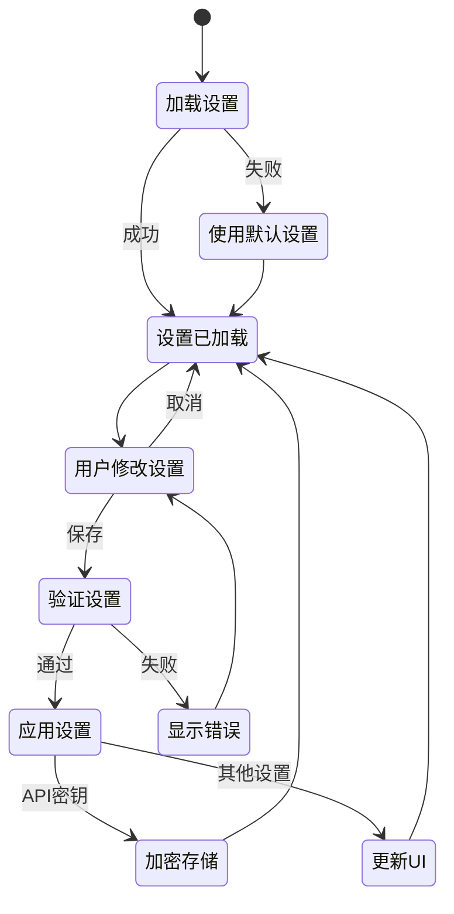

#### 设置管理状态流转

```mermaid
stateDiagram-v2
    [*] --> 加载设置
    
    加载设置 --> 设置已加载 : 成功
    加载设置 --> 使用默认设置 : 失败
    
    使用默认设置 --> 设置已加载
    
    设置已加载 --> 用户修改设置
    
    用户修改设置 --> 验证设置 : 用户保存
    用户修改设置 --> 设置已加载 : 用户取消
    
    验证设置 --> 应用设置 : 验证通过
    验证设置 --> 显示错误 : 验证失败
    
    显示错误 --> 用户修改设置
    
    应用设置 --> 更新UI主题 : 主题变更
    应用设置 --> 更新字体大小 : 字体变更
    应用设置 --> 保存到磁盘 : API密钥变更
    应用设置 --> 设置已加载 : 其他设置
    
    更新UI主题 --> 设置已加载
    更新字体大小 --> 设置已加载
    保存到磁盘 --> 加密存储 : API密钥
    加密存储 --> 设置已加载
    
    设置已加载 --> 导出设置 : 用户导出
    设置已加载 --> 导入设置 : 用户导入
    
    导出设置 --> 设置已加载
    导入设置 --> 验证设置
    
    note right of 加密存储
        API密钥使用AES加密
        本地安全存储
    end note
    
    note right of 实时预览
        设置更改立即反映在UI上
        提供更好的用户体验
    end note
```

## AI工具使用方法

### API密钥配置

1. **打开设置界面**
   - 点击左侧历史栏底部的"设置"按钮
   - 或点击右上角的设置图标

2. **添加API密钥**
   ```
   1. 在"API密钥管理"部分点击"添加API密钥"
   2. 选择密钥类型（DeepSeek/Gemini）
   3. 输入密钥名称（便于管理）
   4. 输入API密钥
   5. 点击"添加"保存
   ```

3. **密钥管理**
   - 支持添加多个同类型密钥
   - 自动轮换使用，提高可用性
   - 可随时删除或编辑密钥

### AI对话功能

#### 基础对话
```
用户: 解释一下机器学习中的梯度下降算法

AI: 梯度下降是一种优化算法，用于找到函数的最小值...
```

#### COT（思维链）功能
```
用户: [COT] 计算圆周率π的近似值

AI: <details>
<summary>🧠 思考过程</summary>

让我使用几种方法来计算π的近似值：

1. 蒙特卡洛方法...
2. 级数展开...
</details>

最终答案：π ≈ 3.14159...
```

#### 特殊API调用

##### Wolfram Alpha计算
```
> wolfram alpha: integrate x^2 from 0 to 1
```
自动调用Wolfram Alpha进行积分计算

##### 图表生成
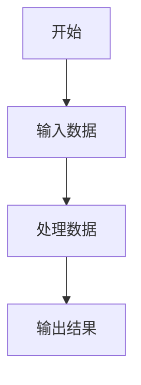

### 文档上传与处理

1. **支持的文件格式**
   - Word文档 (.docx)
   - PDF文件 (.pdf)
   - 文本文件 (.txt, .md等)

2. **上传方法**
   - 点击输入框左侧的上传按钮
   - 选择要上传的文件
   - 系统自动解析文档内容

3. **处理结果**
   - 提取的文本内容会自动添加到对话中
   - 可要求AI对文档内容进行分析、总结等

## 项目结构详解

### 模块依赖关系图

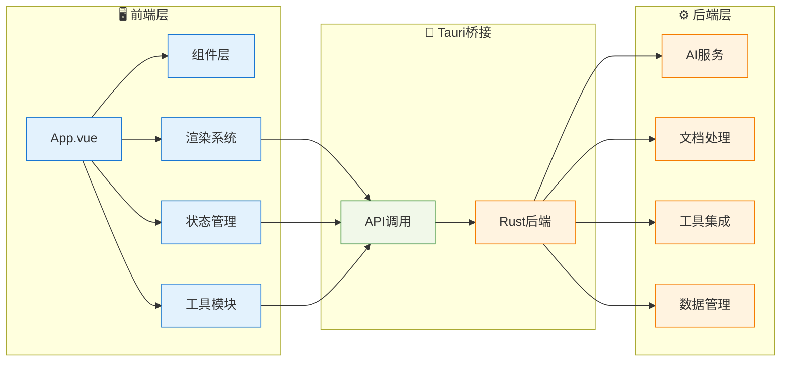

### 目录结构树

```
NPULearn/
├── src/                          # Vue前端源码
│   ├── App.vue                   # 主应用组件
│   ├── main.ts                   # 应用入口
│   ├── style.css                 # 全局样式
│   ├── themeUtils.ts             # 主题工具函数
│   │
│   ├── components/               # Vue组件
│   │   ├── LoadingLogo.vue       # 加载动画组件
│   │   └── Setting.vue           # 设置界面组件
│   │
│   ├── composables/              # Vue组合式函数
│   │   ├── useFileManager.ts     # 文件管理功能
│   │   └── useSettings.ts        # 设置管理功能
│   │
│   ├── App/                      # 应用核心逻辑
│   │   ├── main.ts               # 应用主逻辑
│   │   ├── types.ts              # 类型定义
│   │   ├── eventBus.ts           # 事件总线
│   │   ├── mathjax.ts            # MathJax配置
│   │   ├── chatHistory.ts        # 聊天历史管理
│   │   │
│   │   └── typesetting/          # 排版渲染模块
│   │       ├── typesetting.ts    # 排版主控制器
│   │       ├── htmlRenderer.ts   # HTML渲染器
│   │       ├── katexRenderer.ts  # KaTeX数学渲染器
│   │       ├── mermaidRenderer.ts # Mermaid图表渲染器
│   │       ├── pintoraRenderer.ts # Pintora图表渲染器
│   │       ├── typstRenderer.ts  # Typst排版渲染器
│   │       ├── wolframRenderer.ts # Wolfram结果渲染器
│   │       └── interactiveButton.ts # 交互按钮功能
│   │
│   ├── assets/                   # 静态资源
│   ├── styles/                   # 样式文件
│   ├── utils/                    # 工具函数
│   └── workers/                  # Web Workers
│       └── renderWorker.ts       # 渲染工作线程
│
├── src-tauri/                    # Tauri Rust后端
│   ├── src/
│   │   ├── main.rs               # 主程序入口
│   │   ├── lib.rs                # 库入口
│   │   │
│   │   ├── aibackend/            # AI后端集成
│   │   │   ├── mod.rs            # 模块定义
│   │   │   ├── interface.rs      # AI接口定义
│   │   │   ├── apikey.rs         # API密钥管理
│   │   │   ├── deepseek.rs       # DeepSeek集成
│   │   │   ├── gemini.rs         # Gemini集成
│   │   │   ├── template.rs       # 提示词模板
│   │   │   └── openai_types.rs   # OpenAI类型定义
│   │   │
│   │   ├── ai_utils/             # AI工具模块
│   │   │   ├── mod.rs
│   │   │   ├── wolframalpha.rs   # Wolfram Alpha集成
│   │   │   ├── mathworld.rs      # 数学世界搜索
│   │   │   └── online_python_exec.rs # 在线Python执行
│   │   │
│   │   ├── document_reader/      # 文档读取模块
│   │   │   ├── mod.rs
│   │   │   ├── pdf_reader.rs     # PDF阅读器
│   │   │   ├── word_reader.rs    # Word阅读器
│   │   │   └── text_reader.rs    # 文本阅读器
│   │   │
│   │   ├── document_renderer/    # 文档渲染模块
│   │   │   ├── mod.rs
│   │   │   ├── renderer.rs       # 渲染器主控制
│   │   │   └── wolfram.rs        # Wolfram结果渲染
│   │   │
│   │   ├── file_manager/         # 文件管理模块
│   │   │   └── mod.rs
│   │   │
│   │   ├── history_msg/          # 历史消息管理
│   │   │   ├── mod.rs
│   │   │   ├── history.rs        # 历史记录操作
│   │   │   └── test/             # 测试文件
│   │   │
│   │   ├── setting/              # 设置管理模块
│   │   │   ├── mod.rs
│   │   │   └── setting.rs        # 设置存储和管理
│   │   │
│   │   └── multi_platform/       # 多平台支持
│   │       ├── mod.rs
│   │       └── android/          # Android特定代码
│   │
│   ├── gen/                      # 生成的代码
│   │   ├── android/              # Android构建文件
│   │   └── schemas/              # JSON Schema文件
│   │
│   ├── capabilities/             # Tauri权限配置
│   ├── icons/                    # 应用图标
│   ├── build.rs                  # 构建脚本
│   ├── Cargo.toml                # Rust依赖配置
│   └── tauri.conf.json           # Tauri配置
│
├── build/                        # 构建输出目录
├── output/                       # 应用输出目录
├── package.json                  # Node.js依赖配置
├── vite.config.ts                # Vite配置
├── tsconfig.json                 # TypeScript配置
├── bun.lock                      # Bun锁定文件
├── README.md                     # 项目说明
└── LICENSE                       # 许可证文件
```

## 关键设计模式

### 1. 模块化架构
每个功能模块都是独立的，具有清晰的接口定义：

```typescript
// 事件总线模式
export const AppEvents = {
    sendStreamMessageDirect: (message: string) => { /* ... */ },
    showNotification: (message: string, type: string) => { /* ... */ },
    openChartViewer: (svgContent: string, sourceCode: string) => { /* ... */ }
};
```

### 2. 策略模式
不同的渲染器使用策略模式：

```typescript
const renderers = {
    mermaid: handleMermaidRender,
    wolfram: handleWolframRender,
    katex: handleKaTeXRender
};
```

### 3. 观察者模式
主题变化和设置更新使用观察者模式：

```typescript
watch(() => settings.value.theme, (newTheme) => {
    applyTheme(newTheme);
});
```

## 性能优化策略

### 1. 渲染优化
- **异步渲染**: 避免阻塞主线程
- **批量处理**: 合并多个渲染请求
- **缓存机制**: 避免重复渲染

### 2. 内存管理
- **垃圾回收**: 及时清理不再使用的对象
- **事件监听器清理**: 防止内存泄漏
- **图片懒加载**: 减少内存占用

### 3. 网络优化
- **请求缓存**: 避免重复API调用
- **连接池**: 复用HTTP连接
- **错误重试**: 智能重试机制

## 创新亮点总结

### 1. 用户体验创新
- **实时流式输出**: AI回复实时显示，如同真人对话
- **思维链可视化**: COT功能让AI推理过程透明化
- **一键交互**: 复杂操作简化为一键完成
- **智能主题**: 跟随系统或手动切换，护眼体验

### 2. 技术创新
- **渲染器架构**: 模块化、可扩展的渲染系统
- **多AI统一**: 统一接口支持多种AI模型
- **跨平台一致**: 桌面端和移动端体验一致
- **类型安全**: 全栈TypeScript+Rust类型安全

### 3. 功能创新
- **工具集成**: 将专业工具无缝集成到对话中
- **文档理解**: 智能解析多种文档格式
- **交互式结果**: 计算结果可进一步交互
- **上下文保持**: 长对话中保持上下文连贯

### 4. 性能创新
- **异步优先**: 全面采用异步编程模型
- **内存高效**: Rust后端提供高性能计算
- **智能缓存**: 多级缓存提升响应速度
- **错误恢复**: 优雅的错误处理和恢复机制

### 5. AI应用创新特性

#### 智能决策系统
- **动态模型路由**: 根据查询类型自动选择最适合的AI模型
- **上下文感知**: 基于对话历史和用户偏好调整响应策略
- **质量自检**: 内置响应质量验证和自动纠错机制
- **个性化学习**: 从用户交互中学习偏好，提供定制化体验

#### 高级推理能力
- **结构化思维链**: 可视化AI推理过程，增强可解释性
- **多步骤验证**: 对复杂问题进行多层次验证确保准确性
- **知识图谱整合**: 将零散信息整合为结构化知识网络
- **创新性推理**: 能够进行类比推理和创造性问题解决

#### 工具协作生态
- **智能工具编排**: 自动选择和组合多个工具完成复杂任务
- **并行处理优化**: 智能识别可并行执行的操作，显著提升效率
- **结果智能合并**: 将多个工具的输出整合为统一、连贯的结果
- **容错与降级**: 工具失效时自动切换备选方案

#### 记忆与学习系统
- **长期记忆管理**: 建立用户专属的知识库和记忆体系
- **智能遗忘机制**: 根据重要性和使用频率管理记忆存储
- **个性化内容生成**: 基于用户学习历史和偏好定制内容
- **进度跟踪优化**: 实时调整学习难度和内容推荐

## 设计哲学与价值观

### 1. 以人为本的设计理念

#### 认知负荷最小化
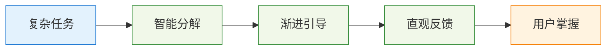

我们坚信技术应该简化而非复杂化用户的学习过程。通过智能任务分解、渐进式功能揭示和直观的交互设计，让用户能够专注于学习内容本身，而不是工具的使用方法。

#### 包容性设计原则
- **多样化学习风格支持**: 视觉、听觉、动手实践等多种学习方式
- **无障碍功能**: 支持屏幕阅读器、键盘导航、高对比度模式
- **多语言支持**: 国际化设计，支持多种语言和文化背景
- **设备适配**: 从高端工作站到入门级设备都能流畅运行

### 2. 开放与协作的技术哲学

#### 开源生态贡献
```typescript
// 开放式架构设计
interface ExtensionAPI {
    // 允许第三方开发者扩展功能
    registerRenderer(name: string, renderer: Renderer): void;
    registerAIProvider(name: string, provider: AIProvider): void;
    registerTool(name: string, tool: Tool): void;
}

// 插件系统支持
export class PluginManager {
    // 动态加载和管理插件
    public async loadPlugin(pluginPath: string): Promise<Plugin> {
        const plugin = await import(pluginPath);
        return this.initializePlugin(plugin);
    }
    
    // 安全的插件沙箱
    public createSandbox(plugin: Plugin): PluginSandbox {
        return new PluginSandbox(plugin, this.securityPolicy);
    }
}
```

我们相信最好的软件是通过社区协作创造的。NPULearn 采用开放架构，鼓励社区贡献新功能、修复bug和改进文档。

#### 标准化与互操作性
- **标准协议支持**: 遵循 OpenAI API 标准，确保与主流AI服务兼容
- **数据格式开放**: 使用通用的数据格式，避免厂商锁定
- **接口标准化**: 提供清晰的API文档，便于第三方集成
- **跨平台兼容**: 确保在不同操作系统上的一致体验

### 3. 可持续发展的产品理念

#### 性能与环保平衡
```rust
// 绿色计算优化
pub struct GreenComputingOptimizer {
    energy_monitor: EnergyMonitor,
    performance_profiler: PerformanceProfiler,
    optimization_strategies: Vec<OptimizationStrategy>,
}

impl GreenComputingOptimizer {
    // 智能资源调度
    pub async fn optimize_resource_usage(
        &self,
        workload: Workload,
        power_budget: PowerBudget,
    ) -> OptimizationResult {
        // 根据电源状态和性能需求动态调整计算强度
        let optimal_strategy = self.calculate_optimal_strategy(
            workload.complexity,
            power_budget.available_power,
            self.energy_monitor.current_efficiency()
        );
        
        // 实施优化策略
        self.apply_optimization(optimal_strategy).await
    }
}
```

在追求高性能的同时，我们也关注软件的能效比和环境影响。通过智能资源管理、按需计算和绿色算法，最小化能源消耗。

#### 用户隐私保护
- **本地优先处理**: 尽可能在本地处理敏感数据
- **加密存储**: 所有用户数据都经过加密处理
- **透明的数据使用**: 明确告知数据的使用目的和范围
- **用户控制权**: 用户可以随时导出或删除自己的数据

### 4. 教育技术的未来愿景

#### 个性化学习的深度实践
我们认为每个学习者都是独特的，应该有属于自己的学习路径。通过AI技术，我们能够：

- **识别学习模式**: 分析用户的学习行为，识别最有效的学习策略
- **动态调整内容**: 根据理解程度实时调整内容难度和呈现方式
- **预测学习困难**: 提前识别可能遇到的学习障碍，主动提供支持
- **激发学习兴趣**: 通过游戏化和互动化提升学习体验

#### 知识民主化的推动者
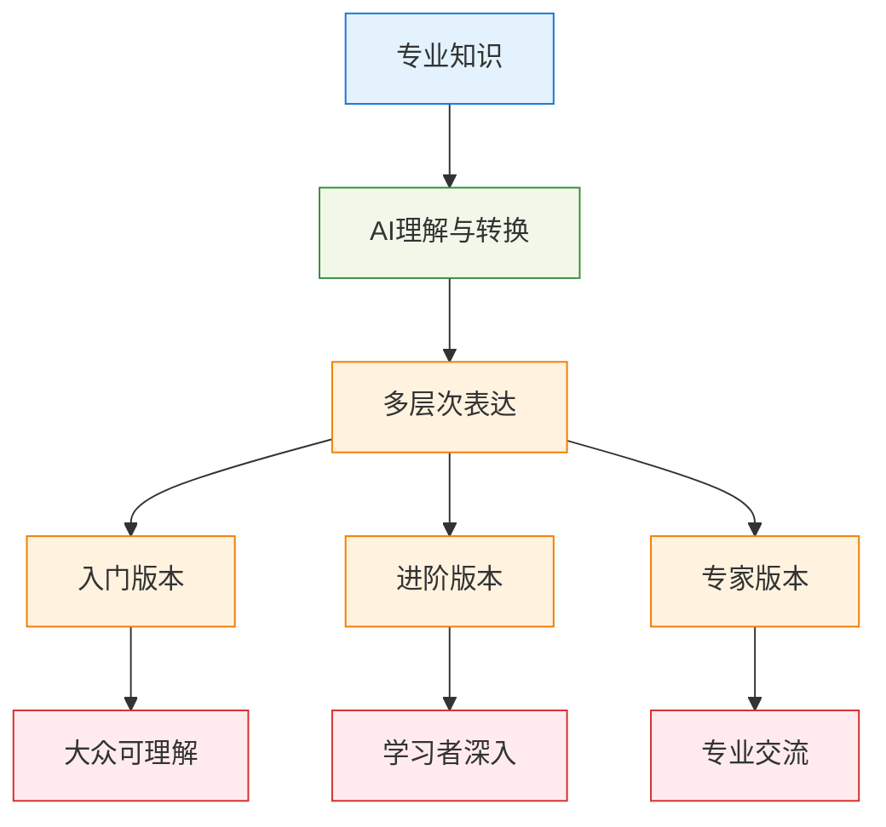

我们致力于打破知识获取的壁垒，让高质量的教育资源惠及更多人群。通过AI技术，复杂的专业知识可以转化为不同层次的表达，满足不同背景用户的需求。

## 技术债务管理与代码质量

### 1. 代码质量保证体系

#### 多层次代码检查
```yaml
# 代码质量检查流水线
quality_gates:
  - name: "静态分析"
    tools: ["eslint", "clippy", "typescript", "prettier"]
    failure_threshold: "zero_warnings"
    
  - name: "安全扫描"
    tools: ["semgrep", "cargo-audit", "snyk"]
    failure_threshold: "no_high_severity"
    
  - name: "性能测试"
    tools: ["lighthouse", "criterion", "hyperfine"]
    thresholds:
      performance_score: ">= 90"
      memory_usage: "<= 100MB"
      startup_time: "<= 3s"
      
  - name: "兼容性测试"
    platforms: ["windows", "linux", "macos", "android"]
    browsers: ["chrome", "firefox", "safari", "edge"]
```

#### 技术债务跟踪
```typescript
// 技术债务管理系统
export class TechnicalDebtTracker {
    private debtItems: Map<string, DebtItem> = new Map();
    
    // 识别技术债务
    public identifyDebt(codeMetrics: CodeMetrics): DebtItem[] {
        const debts: DebtItem[] = [];
        
        // 复杂度债务
        if (codeMetrics.cyclomaticComplexity > 10) {
            debts.push({
                type: 'complexity',
                severity: 'medium',
                description: 'Function complexity exceeds threshold',
                estimatedEffort: this.calculateRefactoringEffort(codeMetrics),
                impact: this.assessBusinessImpact(codeMetrics)
            });
        }
        
        // 重复代码债务
        const duplicateBlocks = this.findDuplicateCode(codeMetrics);
        for (const block of duplicateBlocks) {
            debts.push({
                type: 'duplication',
                severity: 'low',
                description: `Duplicate code block: ${block.location}`,
                estimatedEffort: this.calculateDeduplicationEffort(block),
                impact: 'maintenance_burden'
            });
        }
        
        return debts;
    }
    
    // 债务偿还优先级排序
    public prioritizeDebtPayment(debts: DebtItem[]): DebtItem[] {
        return debts.sort((a, b) => {
            const scoreA = this.calculateDebtScore(a);
            const scoreB = this.calculateDebtScore(b);
            return scoreB - scoreA; // 高分优先
        });
    }
}
```

### 2. 性能监控与优化

#### 实时性能监控
```rust
// 性能监控系统
pub struct PerformanceMonitor {
    metrics_collector: MetricsCollector,
    alert_manager: AlertManager,
    optimization_engine: OptimizationEngine,
}

impl PerformanceMonitor {
    // 实时性能指标收集
    pub async fn collect_metrics(&mut self) -> PerformanceMetrics {
        let system_metrics = self.collect_system_metrics().await;
        let application_metrics = self.collect_application_metrics().await;
        let user_experience_metrics = self.collect_ux_metrics().await;
        
        PerformanceMetrics {
            timestamp: Utc::now(),
            cpu_usage: system_metrics.cpu_usage,
            memory_usage: system_metrics.memory_usage,
            disk_io: system_metrics.disk_io,
            network_io: system_metrics.network_io,
            response_times: application_metrics.response_times,
            error_rates: application_metrics.error_rates,
            user_satisfaction: user_experience_metrics.satisfaction_score,
        }
    }
    
    // 性能异常检测
    pub fn detect_anomalies(&self, metrics: &PerformanceMetrics) -> Vec<Anomaly> {
        let mut anomalies = Vec::new();
        
        // 使用统计方法检测异常
        if self.is_statistical_anomaly(&metrics.response_times) {
            anomalies.push(Anomaly {
                metric: "response_time".to_string(),
                severity: self.calculate_severity(&metrics.response_times),
                description: "Response time significantly higher than normal".to_string(),
                suggested_actions: vec![
                    "Check database queries".to_string(),
                    "Review recent code changes".to_string(),
                    "Monitor system resources".to_string(),
                ],
            });
        }
        
        anomalies
    }
}
```

#### 自适应性能优化
```typescript
// 自适应优化引擎
export class AdaptiveOptimizer {
    private optimizationStrategies: OptimizationStrategy[] = [
        new CacheOptimization(),
        new RenderingOptimization(),
        new NetworkOptimization(),
        new MemoryOptimization()
    ];
    
    // 动态优化策略选择
    public async optimizePerformance(
        currentMetrics: PerformanceMetrics,
        userContext: UserContext
    ): Promise<OptimizationResult> {
        // 分析性能瓶颈
        const bottlenecks = this.identifyBottlenecks(currentMetrics);
        
        // 为每个瓶颈选择最优策略
        const optimizations = [];
        
        for (const bottleneck of bottlenecks) {
            const strategy = this.selectOptimalStrategy(
                bottleneck,
                userContext,
                currentMetrics
            );
            
            const result = await strategy.apply(bottleneck);
            optimizations.push(result);
        }
        
        // 验证优化效果
        const improvedMetrics = await this.measurePostOptimizationMetrics();
        const improvement = this.calculateImprovement(
            currentMetrics,
            improvedMetrics
        );
        
        return {
            applied_optimizations: optimizations,
            performance_improvement: improvement,
            recommendations: this.generateRecommendations(improvement)
        };
    }
}
```

## 社区建设与生态发展

### 1. 开源社区战略

#### 贡献者成长路径
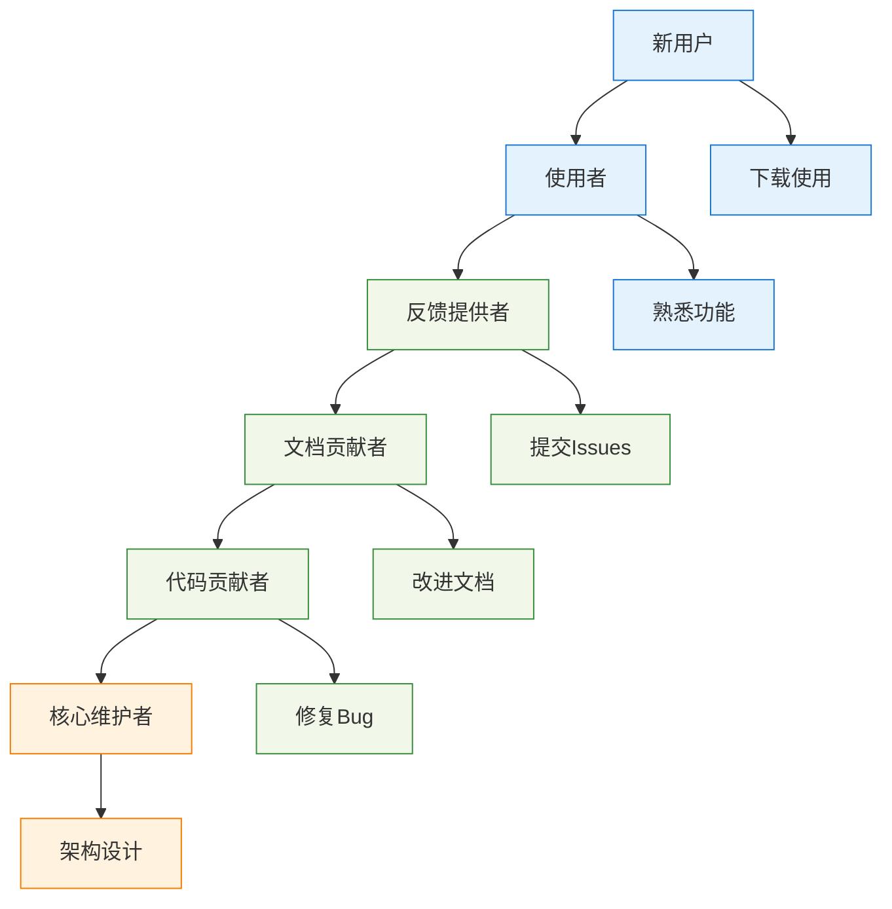

#### 社区治理模型
```yaml
# 社区治理结构
governance:
  core_team:
    - role: "项目负责人"
      responsibilities: ["战略规划", "版本发布", "重大决策"]
      
    - role: "技术负责人"
      responsibilities: ["架构设计", "代码审查", "技术标准"]
      
    - role: "社区管理员"
      responsibilities: ["社区建设", "用户支持", "文档维护"]
  
  decision_making:
    - type: "功能请求"
      process: "社区讨论 -> RFC -> 投票 -> 实施"
      
    - type: "重大变更"
      process: "核心团队讨论 -> 社区征求意见 -> 决策"
      
    - type: "日常维护"
      process: "维护者直接决策"
```

### 2. 生态系统建设

#### 插件生态架构
```typescript
// 插件开发框架
export interface PluginAPI {
    // 核心功能扩展
    addRenderer(name: string, renderer: RendererPlugin): void;
    addAIProvider(name: string, provider: AIProviderPlugin): void;
    addTool(name: string, tool: ToolPlugin): void;
    
    // 用户界面扩展
    addTheme(name: string, theme: ThemePlugin): void;
    addComponent(name: string, component: ComponentPlugin): void;
    
    // 数据处理扩展
    addDataProcessor(name: string, processor: DataProcessorPlugin): void;
    addExporter(name: string, exporter: ExporterPlugin): void;
}

// 插件开发模板
export abstract class NPULearnPlugin {
    abstract name: string;
    abstract version: string;
    abstract description: string;
    
    // 生命周期钩子
    async onLoad(api: PluginAPI): Promise<void> {}
    async onUnload(): Promise<void> {}
    async onSettingsChange(settings: PluginSettings): Promise<void> {}
    
    // 错误处理
    onError(error: Error): void {
        console.error(`Plugin ${this.name} error:`, error);
    }
}
```

#### 第三方集成策略
```rust
// 第三方服务集成框架
pub trait ServiceIntegration: Send + Sync {
    // 服务认证
    async fn authenticate(&self, credentials: Credentials) -> Result<AuthToken, AuthError>;
    
    // 数据同步
    async fn sync_data(&self, data: UserData) -> Result<SyncResult, SyncError>;
    
    // 健康检查
    async fn health_check(&self) -> HealthStatus;
    
    // 服务配置
    fn get_configuration(&self) -> ServiceConfig;
}

// 云服务提供商适配
pub struct CloudProviderAdapter {
    providers: HashMap<String, Box<dyn ServiceIntegration>>,
    fallback_strategy: FallbackStrategy,
}

impl CloudProviderAdapter {
    // 智能服务选择
    pub async fn select_optimal_provider(
        &self,
        requirements: ServiceRequirements,
    ) -> Result<String, SelectionError> {
        let mut candidates = Vec::new();
        
        for (name, provider) in &self.providers {
            let health = provider.health_check().await;
            let config = provider.get_configuration();
            
            if self.meets_requirements(&config, &requirements) && health.is_healthy() {
                candidates.push((name.clone(), self.calculate_score(&config, &requirements)));
            }
        }
        
        candidates.sort_by(|a, b| b.1.partial_cmp(&a.1).unwrap());
        
        candidates.first()
            .map(|(name, _)| name.clone())
            .ok_or(SelectionError::NoSuitableProvider)
    }
}
```

---

*本文档持续更新中，如有问题请提交Issue。*
