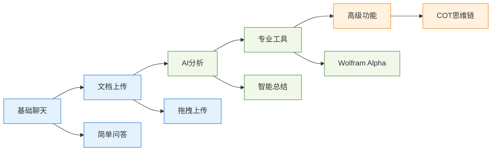
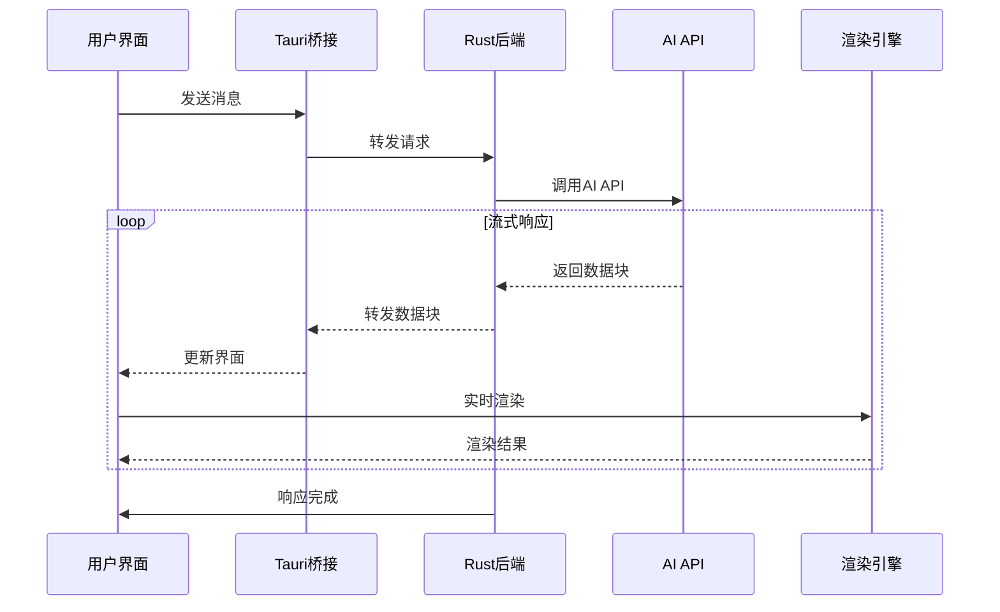
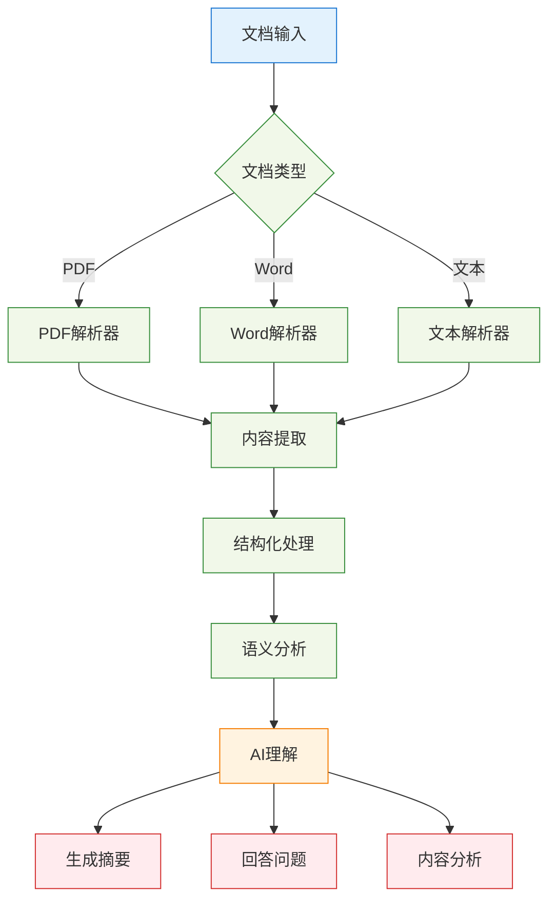
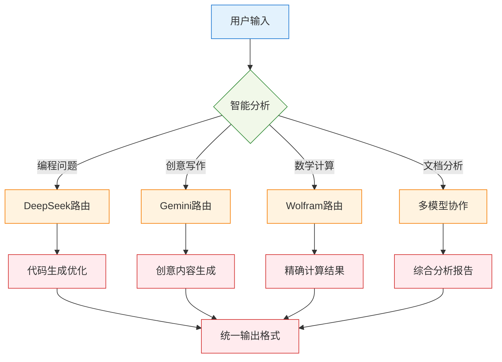
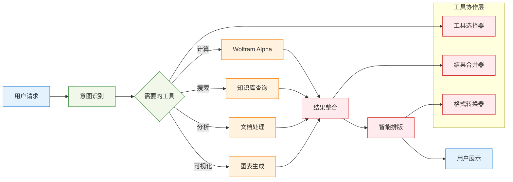
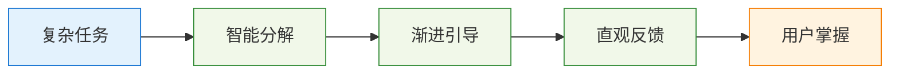
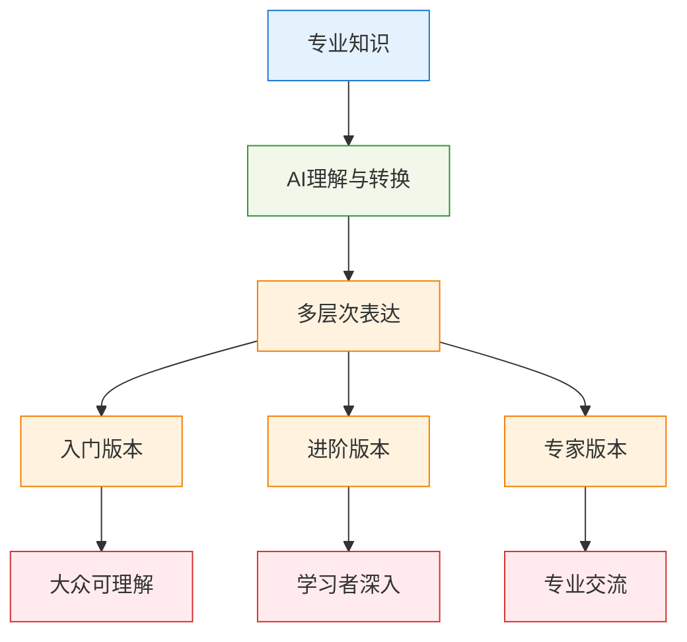
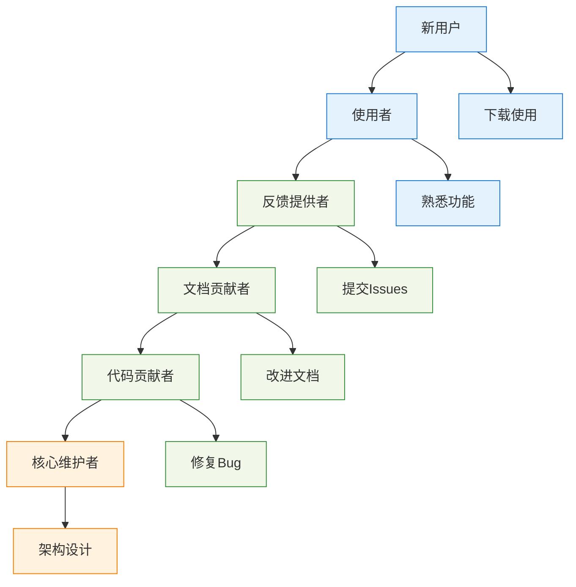

# NPULearn 技术设计思路

## 项目概述

NPULearn 是一个基于 Tauri + Vue + TypeScript 构建的智能学习助手桌面应用，集成多种AI模型和学习工具，为用户提供全面的学习支持。

## 核心设计理念

### 1. 用户中心设计原则

#### 简洁至上
- 界面清爽简洁，专注于内容而非装饰
- 所有功能都能通过直观的交互方式完成
- 支持键盘导航、屏幕阅读器和高对比度模式
- 适配不同屏幕尺寸和设备类型

#### 技术架构理念
- **模块化优先**: 每个功能模块独立开发、测试和部署
- **性能导向**: 使用Rust后端确保高性能计算和内存安全
- **类型安全**: 全栈TypeScript保证代码质量和维护性
- **异步优先**: 所有I/O操作都采用异步模式，确保界面流畅

### 2. 技术栈选择理由

#### 前端：Vue 3 + TypeScript
- 组合式API提供更好的逻辑复用和状态管理
- 响应式数据绑定简化状态管理
- 类型安全保证代码质量

#### 后端：Rust + Tauri
- 高性能的异步处理能力
- 内存安全和并发优势
- 跨平台原生应用支持

#### 渲染系统：多引擎集成
- **MathJax**: 高质量数学公式渲染
- **Mermaid**: 丰富的图表类型支持
- **KaTeX**: 快速数学表达式渲染
- **Typst**: 现代化文档排版

#### 架构优势
1. **跨平台一致性**: Tauri确保在各平台上的一致体验
2. **性能与安全**: Rust后端提供C++级别性能和内存安全
3. **开发效率**: Vue 3的开发体验和TypeScript的类型安全
4. **包体积优化**: 相比Electron显著减小安装包体积

### 3. 用户体验设计原则

#### 渐进式功能揭示

#### 智能默认设置
- **主题跟随系统**: 自动适配用户系统主题偏好
- **智能字体大小**: 根据设备DPI自动调整
- **模型自动选择**: 根据查询类型智能推荐AI模型
- **历史记录分组**: 按时间和主题智能分组历史对话

## AI应用架构设计

### 1. 统一AI接口设计

#### 接口抽象层
采用统一的AI接口设计，支持多种AI模型的无缝切换。通过抽象层隔离具体实现，使系统能够轻松集成新的AI服务商，同时保持调用方式的一致性。

#### 模型适配器模式
为不同AI模型提供标准化的配置接口，包括模型能力、限制参数、成本计算等信息。系统可以根据这些配置信息自动选择最适合的模型处理用户请求。

### 2. 智能对话管理系统

#### 上下文管理策略
实现智能的上下文压缩算法，在维持对话连贯性的同时控制上下文长度。系统会自动保留系统提示、重要历史消息和最近对话，确保AI能够理解当前对话背景。

#### COT（思维链）功能
提供可视化的AI推理过程展示，将复杂的思考步骤分解为用户可理解的步骤。支持折叠/展开显示，让用户既能看到最终结果，也能了解推理过程。

### 3. 流式响应处理机制

#### 实时渲染架构

#### 错误恢复与重试机制
采用智能重试策略，包括指数退避算法、多重错误处理机制和优雅降级方案。确保在网络不稳定或API服务异常时仍能提供基本功能。

### 4. 多模态处理能力

#### 文档理解流程

#### 智能内容理解
系统能够分析文档内容，提取关键信息、生成摘要、识别主题，并评估内容复杂度。支持多种文档格式的智能解析和内容结构化处理。

### 5. 个性化与学习优化

#### 用户偏好学习
通过分析用户的交互行为，学习用户偏好的AI模型、常用主题、响应风格和工具使用习惯。基于这些数据提供个性化的推荐和优化体验。

#### 智能推荐系统
- 推荐合适的AI模型
- 推荐相关工具和功能
- 推荐学习主题和内容
- 个性化界面布局调整

## AI应用创新特性

### 1. 多AI模型融合策略

#### 模型路由智能决策

#### 动态模型选择算法
基于查询特征、上下文长度、成本效益等因素，智能选择最适合的AI模型。系统会分析查询的技术特征，计算各模型的适配分数，自动选择最优模型。

### 2. 高级推理能力增强

#### 思维链（COT）深度实现
提供结构化的思维链生成，包括推理步骤、置信度分数和验证方法。支持不同复杂度级别的推理链生成，并提供可视化的思维过程展示。

#### 自我验证与纠错机制
内置响应质量验证系统，包括事实一致性检查、逻辑连贯性验证、完整性评估等。支持自动错误纠正和响应质量改进。

### 3. 智能工具协作系统

#### 工具链编排引擎

#### 智能工具调用决策
系统能够分析用户需求，自动选择和组合合适的工具。支持并行工具执行、结果智能合并和格式统一处理。

### 4. 上下文感知与记忆管理

#### 长期记忆系统
建立用户专属的知识库，包括短期记忆、长期记忆、情节记忆和语义记忆。支持知识提取、存储、检索和智能遗忘机制。

#### 个性化学习适应
根据用户的知识水平、学习风格和目标，生成个性化的学习内容。支持学习进度跟踪、知识空隙识别和智能推荐。

### 5. 创新交互体验

#### 多模态交互界面
支持文本、语音、手势、图像等多种输入方式的统一处理。提供智能输入预测和意图识别功能。

#### 自适应UI系统
根据用户行为模式自动调整界面布局、功能密度和交互方式。支持个性化快捷操作和智能功能推荐。

## 性能优化策略

### 1. 渲染优化
- **异步渲染**: 避免阻塞主线程的渲染处理
- **智能缓存**: 多级缓存策略减少重复计算
- **批量处理**: 合并多个渲染请求提升效率
- **主题适配**: 所有渲染内容自动适配亮暗主题

### 2. 内存管理
- **垃圾回收**: 及时清理不再使用的对象
- **事件监听器清理**: 防止内存泄漏
- **智能分页**: 大数据集的分页加载
- **资源预加载**: 预测性资源加载优化

### 3. 网络优化
- **请求缓存**: 避免重复API调用
- **连接池**: 复用HTTP连接
- **智能重试**: 指数退避重试机制
- **压缩传输**: 数据压缩减少传输量

## 设计哲学与价值观

### 1. 以人为本的设计理念

#### 认知负荷最小化

我们坚信技术应该简化而非复杂化用户的学习过程。通过智能任务分解、渐进式功能揭示和直观的交互设计，让用户能够专注于学习内容本身。

#### 包容性设计原则
- **多样化学习风格支持**: 视觉、听觉、动手实践等多种学习方式
- **无障碍功能**: 支持屏幕阅读器、键盘导航、高对比度模式
- **多语言支持**: 国际化设计，支持多种语言和文化背景
- **设备适配**: 从高端工作站到入门级设备都能流畅运行

### 2. 开放与协作的技术哲学

#### 开源生态贡献
采用开放式架构设计，支持第三方开发者扩展功能。提供标准化的插件接口，鼓励社区贡献新功能、修复bug和改进文档。

#### 标准化与互操作性
- **标准协议支持**: 遵循 OpenAI API 标准，确保与主流AI服务兼容
- **数据格式开放**: 使用通用的数据格式，避免厂商锁定
- **接口标准化**: 提供清晰的API文档，便于第三方集成
- **跨平台兼容**: 确保在不同操作系统上的一致体验

### 3. 可持续发展的产品理念

#### 性能与环保平衡
通过智能资源调度、按需计算和绿色算法，在追求高性能的同时最小化能源消耗。根据电源状态和性能需求动态调整计算强度。

#### 用户隐私保护
- **本地优先处理**: 尽可能在本地处理敏感数据
- **加密存储**: 所有用户数据都经过加密处理
- **透明的数据使用**: 明确告知数据的使用目的和范围
- **用户控制权**: 用户可以随时导出或删除自己的数据

### 4. 教育技术的未来愿景

#### 个性化学习的深度实践
通过AI技术，为每个学习者提供专属的学习路径：

- **识别学习模式**: 分析用户的学习行为，识别最有效的学习策略
- **动态调整内容**: 根据理解程度实时调整内容难度和呈现方式
- **预测学习困难**: 提前识别可能遇到的学习障碍，主动提供支持
- **激发学习兴趣**: 通过游戏化和互动化提升学习体验

#### 知识民主化的推动者

我们致力于打破知识获取的壁垒，让高质量的教育资源惠及更多人群。通过AI技术，复杂的专业知识可以转化为不同层次的表达。

## 技术债务管理与代码质量

### 1. 代码质量保证体系

#### 多层次代码检查
建立完整的代码质量检查流水线，包括静态分析、安全扫描、性能测试和兼容性测试。设置明确的质量门禁和失败阈值。

#### 技术债务跟踪
实施技术债务管理系统，自动识别复杂度债务、重复代码债务等问题。根据业务影响和修复成本进行债务偿还优先级排序。

### 2. 性能监控与优化

#### 实时性能监控
收集系统性能指标、应用程序指标和用户体验指标。通过统计方法检测性能异常，并提供优化建议。

#### 自适应性能优化
实现动态优化策略选择，包括缓存优化、渲染优化、网络优化和内存优化。验证优化效果并生成改进建议。

## 社区建设与生态发展

### 1. 开源社区战略

#### 贡献者成长路径

#### 社区治理模型
建立清晰的社区治理结构，包括核心团队角色定义、决策流程和社区参与机制。为不同类型的贡献提供相应的参与路径。

### 2. 生态系统建设

#### 插件生态架构
提供完整的插件开发框架，支持渲染器、AI提供商、工具、主题、组件等多种扩展类型。提供插件开发模板和生命周期管理。

#### 第三方集成策略
建立第三方服务集成框架，支持多种云服务提供商。实现智能服务选择和健康状态监控。

## 创新亮点总结

### 1. 用户体验创新
- **实时流式输出**: AI回复实时显示，如同真人对话
- **思维链可视化**: COT功能让AI推理过程透明化
- **一键交互**: 复杂操作简化为一键完成
- **智能主题**: 跟随系统或手动切换，护眼体验

### 2. 技术创新
- **渲染器架构**: 模块化、可扩展的渲染系统
- **多AI统一**: 统一接口支持多种AI模型
- **跨平台一致**: 桌面端和移动端体验一致
- **类型安全**: 全栈TypeScript+Rust类型安全

### 3. 功能创新
- **工具集成**: 将专业工具无缝集成到对话中
- **文档理解**: 智能解析多种文档格式
- **交互式结果**: 计算结果可进一步交互
- **上下文保持**: 长对话中保持上下文连贯

### 4. 性能创新
- **异步优先**: 全面采用异步编程模型
- **内存高效**: Rust后端提供高性能计算
- **智能缓存**: 多级缓存提升响应速度
- **错误恢复**: 优雅的错误处理和恢复机制

### 5. AI应用创新特性

#### 智能决策系统
- **动态模型路由**: 根据查询类型自动选择最适合的AI模型
- **上下文感知**: 基于对话历史和用户偏好调整响应策略
- **质量自检**: 内置响应质量验证和自动纠错机制
- **个性化学习**: 从用户交互中学习偏好，提供定制化体验

#### 高级推理能力
- **结构化思维链**: 可视化AI推理过程，增强可解释性
- **多步骤验证**: 对复杂问题进行多层次验证确保准确性
- **知识图谱整合**: 将零散信息整合为结构化知识网络
- **创新性推理**: 能够进行类比推理和创造性问题解决

#### 工具协作生态
- **智能工具编排**: 自动选择和组合多个工具完成复杂任务
- **并行处理优化**: 智能识别可并行执行的操作，显著提升效率
- **结果智能合并**: 将多个工具的输出整合为统一、连贯的结果
- **容错与降级**: 工具失效时自动切换备选方案

#### 记忆与学习系统
- **长期记忆管理**: 建立用户专属的知识库和记忆体系
- **智能遗忘机制**: 根据重要性和使用频率管理记忆存储
- **个性化内容生成**: 基于用户学习历史和偏好定制内容
- **进度跟踪优化**: 实时调整学习难度和内容推荐

---

*本文档专注于技术设计思路说明，不包含具体代码实现。如需了解详细实现，请参考项目源码。*
